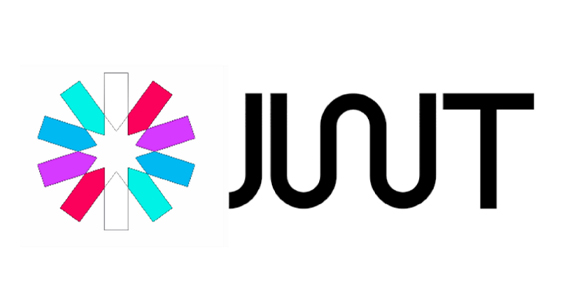
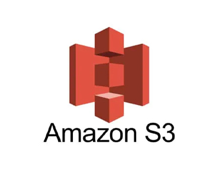
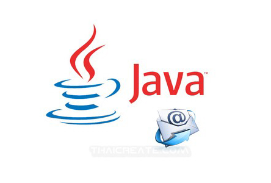
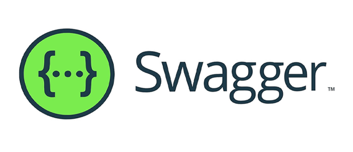
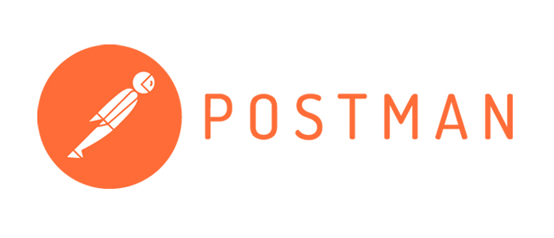
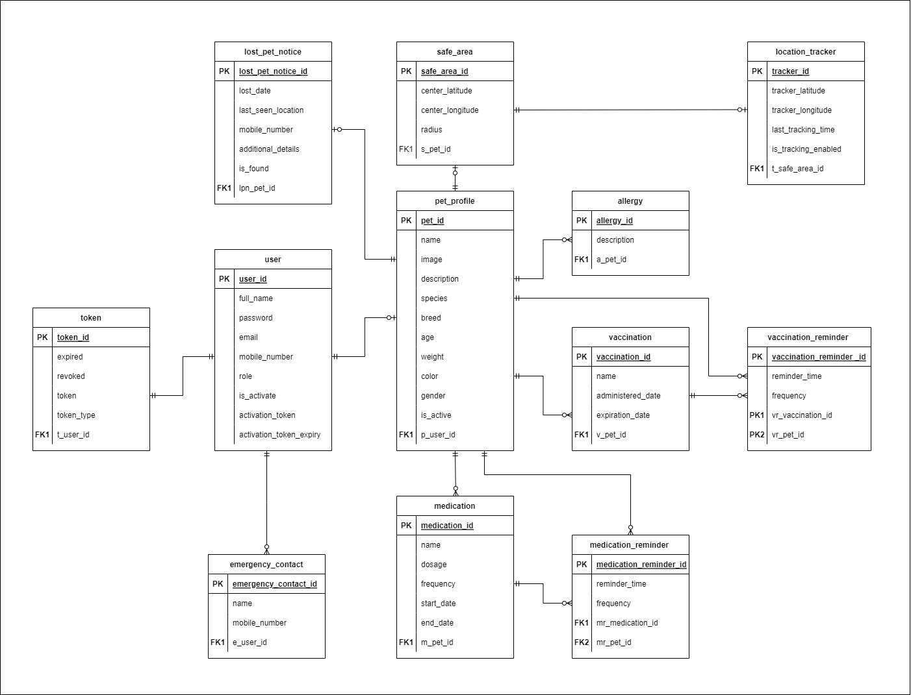

# FurGuard---Backend: Comprehensive Pet Management Mobile Application

Welcome to FurGuard, an innovative pet management application developed using Spring Boot. This README provides an in-depth overview of the project's key components and functionalities, showcasing its advanced features, including JWT authentication, WebSocket programming, seamless integration with the Swapper API, email verification using JavaMail, MySQL database storage, Amazon S3 bucket integration, and a Postman Collection for easy API interaction.

    <!-- SPRING BOOT LOGO -->
    &nbsp;
    <!-- MYSQL LOGO -->
    &nbsp;
    <!-- JWT LOGO -->
    &nbsp;
    <!-- WEBSOCKETS LOGO -->
    &nbsp;
    <!-- AWS-S3 LOGO -->
    &nbsp;
    <!-- JAVA MAIL LOGO -->
    &nbsp;
    <!-- SWAGGER LOGO -->
    &nbsp;
    <!-- POSTMAN LOGO -->
    &nbsp;

## Table of Contents

[Introduction](#introduction)

[Authentication and Security](#authentication-and-security)

[JavaMail Email Verification](#javamail-email-verification)

[Real-time Communication with WebSocket](#real-time-communication-with-websocket)

[Amazon S3 Integration for Effortless Pet Image Management](#amazon-s3-integration-for-effortless-pet-image-management)

[Integration with Swapper API](#integration-with-swapper-api)

[ER Diagram Overview](#er-diagram-overview)

[Features](#features)

[Contributing](#contributing)

## Introduction

FurGuard is a comprehensive pet management application designed to provide pet owners with a convenient tool for monitoring and ensuring the well-being of their beloved animals. With FurGuard, users can effortlessly register their pets and store essential information, including species, breed, age, and gender. The application goes beyond basic pet profiles, offering features such as lost pet notices, emergency contact information, vaccination reminders, safe area management, and pet tracking.

One of the standout features of FurGuard is its advanced pet tracking functionality. Through an intuitive interface, users can establish a central location point and a destination for their pets. In the event that a pet exits a predefined safe area, FurGuard employs WebSocket technology to deliver real-time alerts to the user. This seamless communication enhances pet safety and delivers invaluable peace of mind to pet owners.

## Authentication and Security

FurGuard ensures the security of your pet-related data through JWT (JSON Web Token) authentication. Your data remains private and accessible only to authorized users, providing peace of mind as you manage your pets' information.

## JavaMail Email Verification

FurGuard takes account security seriously by implementing email verification using JavaMail. This feature adds an extra layer of protection to your account and ensures that your pet management data remains confidential and secure.

## Real-time Communication with WebSocket

Experience real-time updates and notifications through WebSocket programming. Receive instant alerts about your pets' activities, reminders, and community interactions, enhancing your overall user experience.

## Amazon S3 Integration for Effortless Pet Image Management

FurGuard enhances your pet management experience by seamlessly integrating with Amazon S3, a cloud storage service. This integration allows you to effortlessly upload, retrieve, and manage pet images, ensuring your furry companions are showcased in all their glory.

## Integration with Swapper API

FurGuard seamlessly integrates with the Swapper API, allowing you to explore a world of pet-related services and products. Access pet supply listings, connect with service providers, and enhance your pet care journey with just a few clicks.

## ER Diagram Overview

## Features
### Furry Profile

* Save Profile

* Update Profile

* Fetch Profile By ID

* Delete Profile

### Authentication

* Register

* Email Verification

* Logout

* Authenticate

* Refresh Token

* User Deactivated

### Emergency Contact

* Save Contact

* Update Contact

* Fetch All Contacts

* Delete Contact

### Vaccination

* Add Vaccination

* Update Vaccination

* Fetch Vaccination

* Fetch All Vaccinations

* Delete Vaccination

### Medication Reminder

* Add Medication Reminder

* Update Medication Reminder

* Fetch Medication Reminder

* Fetch All Medication Reminders

* Delete Medication Reminder

### Allergy

* Add Allergy

* Update Allergy

* Fetch All Allergies

* Delete Allergy

### Vaccination Reminder

* Add Vaccination Reminder

* Update Vaccination Reminder

* Fetch Vaccination Reminder

* Fetch All Vaccination Reminders

* Delete Vaccination Reminder

### Medication Reminder

* Add Medication Reminder

* Update Medication Reminder

* Fetch Medication Reminder

* Fetch All Medication Reminders

* Delete Medication Reminder

### Lost Pet Notice

* Get Lost Pet Notice

* Update Lost Pet Notice

* Set As Found

* Set As Not Found

* Remove Lost Pet Notice

### Home

* Get All Notices

* Get Notice By ID

* Get All Reminders

### Safe Area

* Set Safe Area

* Update Safe Area

* Get Safe Area

* Remove Safe Area

### Location Tracker

* Set Tracker

* Fetch Tracker Details

* Set Tracker Off

* Remove Tracker

### Welcome Message

* Welcome Message

## Contributing

We welcome contributions from the open-source community! Whether you're a developer, designer, or pet enthusiast, your ideas and contributions can make FurGuard even better. See our Contribution Guidelines to get involved.